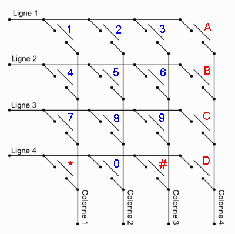
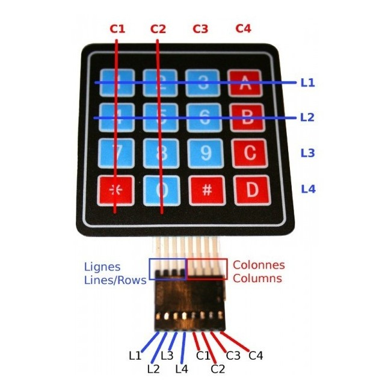
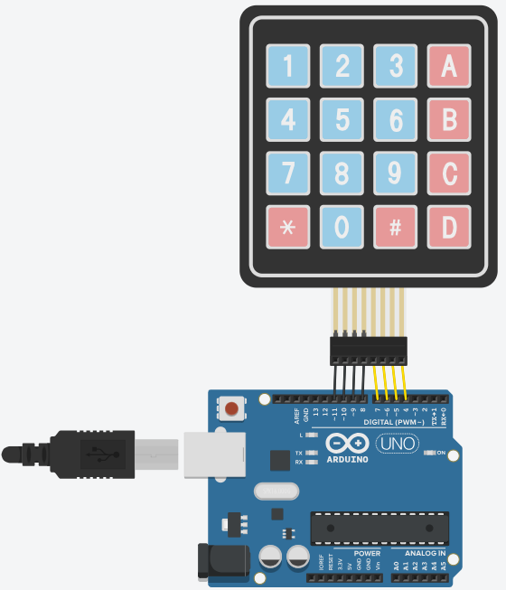

# 1- Le clavier matriciel

## Sommaire

## Schéma électrique du clavier matriciel

Ce clavier comprend 16 touches disposées en 4 lignes et 4 colonnes.
L'appui sur une touche fait communiquer une ligne avec une colonne.

## Schéma de cablage & Code

Voici un câble es son code qui correspond.

[Code Arduino](./code.ino)