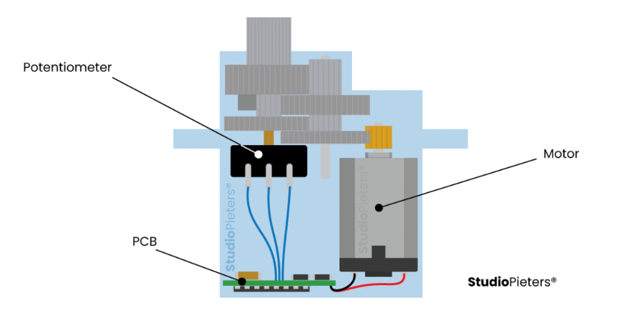
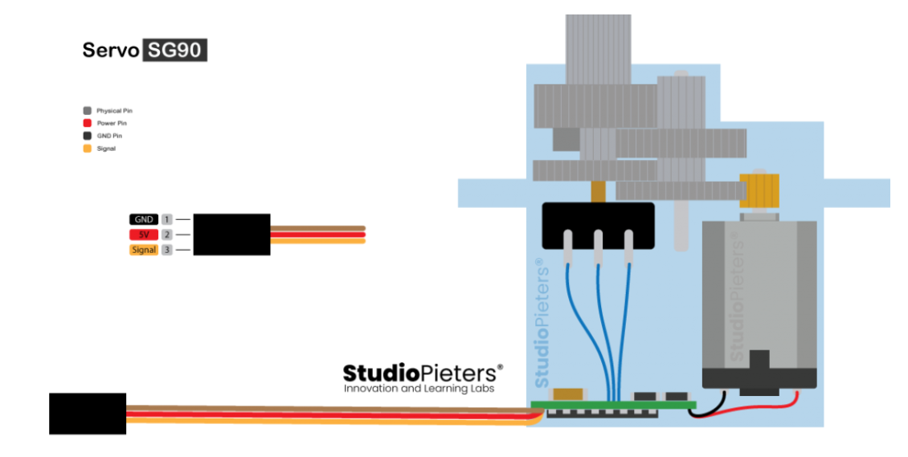
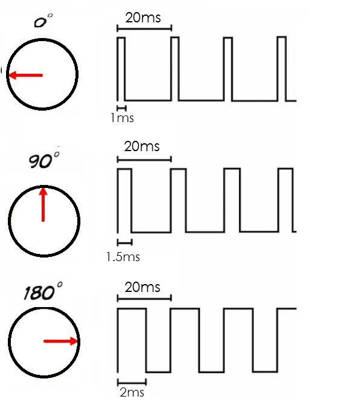
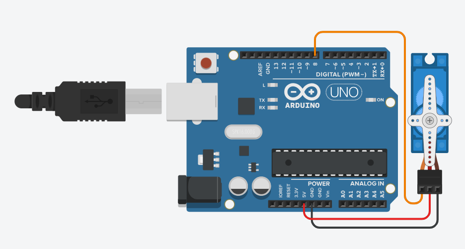
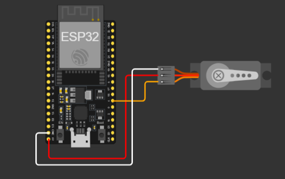

# 1- Le clavier matriciel

## Sommaire

## Servomoteur

## Signaux d'un servomoteur

Pour commander un servomoteur, il faut lui envoyer un train d'impulsions dont la période (intervalle de temps entre chaque impulsion) est toujours de 20 ms (millisecondes). Ce qui va varier et qui finalement déterminera la position du bras n'est pas la période, mais bien la durée de l'impulsion :

- pour une impulsion de 1 ms, le servomoteur se met en position 0° ;
- pour une impulsion de 1,5 ms, le servomoteur se met en positon 90° ;
- pour une impulsion de 2 ms, le servomoteur se met en position 180°.

## Schéma de cablage & Code

### Arduino

Voici un câble es son code qui correspond.

[Code Arduino](./code.ino)

### Esp32

Voici un câble es son code qui correspond.

[Code Esp32](./code.py)